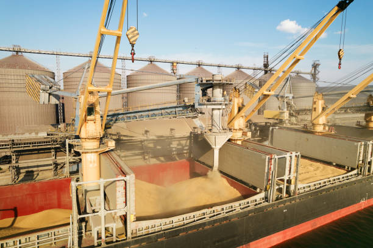
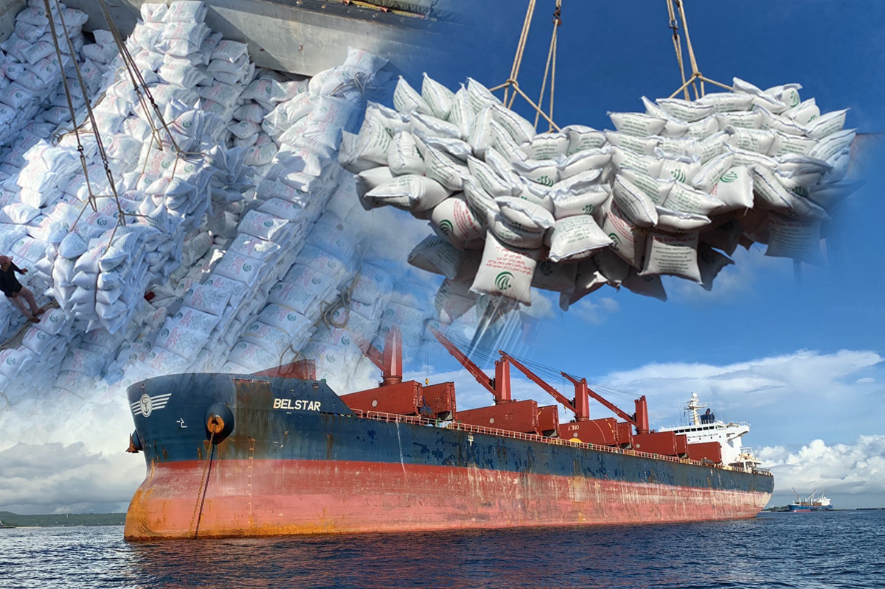

# README  
## "The cargo(Rice) import business in Singapore with weather conditions
###
**Project name: Shipping Risk Analysis Project**

**Description:** this project uses weather data to analyze the impact on the rice import business in Singapore.

**Dataset:**  The data includes the average monthly rainfall, number of rainy days, average monthly humidity, and average monthly temperature from 1982 to 2022.
              
| Feature          | Type       | Dataset                               | Description                                      |
|:----------------:|:----------:|:-------------------------------------:|:------------------------------------------------:|
| **year_month**   | datetime64 | rainfall-monthly-total                | Month and year of the data                        |
| **total_rainfall** | float      | rainfall-monthly-total                | Total rainfall in mm                             |
| **no_of_rainy_days** | float    | rainfall-monthly-number-of-rain-days  | Total number of days with rain each month          |
| **mean_rh**      | float      | RelativeHumidityMonthlyMean           | Monthly average percentage of relative humidity   |
| **mean_temp**    | float      | SurfaceAirTemperatureMonthlyMean       | The monthly average air temperature in Celsius    |
             
**Objective:** 
   1.  Analyze weather data to assess the risks and opportunities of shipping goods by sea
   2.  Develop best practices for shipping goods by sea in a variety of weather conditions


# Problem Statement
### In the unloading of goods (rice) from ships, which will be affected by the weather, there are two main problems
   1. Delays: Weather conditions, such as storms, strong winds, and heavy rain, can make it difficult or impossible to unload cargo from ships. This can lead to delays in the delivery of goods, which can increase costs for shippers.
   2. Product quality: Bad weather can also damage goods, such as rice. This can lead to quality problems, such as mold or spoilage, which can also increase costs for shippers.

              
              
**Questions:**  
1. How can we reduce the impact of weather on importing rice in Singapore?
2. How does climate change impact the quality of imported rice?
3. Which months have the heaviest rainfall , as well as which months have the most rainy days.


                
## Conclusions and Recommendations

1. We analyzed the data and found that November, December, and January are the months with the highest total rainfall. Our tests showed that high rainfall leads to higher relative humidity ,The calculations reveal that a higher quantity of rainfall leads to increased humidity in the air, consequently resulting in damage to the goods during transportation.There are two types of cargo handling at the port: bulk cargo and packaged cargo. Therefore, I recommend that operators import rice in packaged form during `November - January`This will reduce the risk of damage from rain and humidity exposure to the goods.
    - The advantage of bulk cargo transportation is that it can import a large amount of Cargo, but the disadvantage is that the cargo are more susceptible to damage from the weather.
        
        
    
    - The advantage of package transportation is that it is less susceptible to damage from the weather than bulk cargo, but the disadvantage is that it can import less goods than bulk cargo.
    
       
2. In the transportation of rice by ship, if it rains, the cargo handling must be stopped. Cargo handling has many costs, such as port fees. If we handle bulk cargo in months with heavy rain, we will have to pay a lot of port fees. However, if we handle packaged cargo during the months of heavy rain, we can save on port service costs and reduce the risk of damage to rice.
3. The months with the heaviest rainfall are` November`, `December`, and `January`, which have significantly higher average rainfall than other months

In summary, I recommend handling bulk cargo during the months of February to October. This is because bulk cargo can be imported in large quantities and the months of February to October are not the rainy season in Singapore. During the months of November to January, I recommend handling packaged cargo. This is because packaged cargo is less susceptible to damage from rain, which can lead to port fees and damage claims

## Solution
1. Data exploration to investigate the relationship between weather and shipping risk
2. Develop best practices for shipping goods(rice) by ship in a variety of weather conditions                   

**Impact:** 
1. Helps shipping companies to improve efficiency and reduce operation costs
2. Helps shipping companies to respond to climate change effectively 
3. Help to reduce the risk of climate damage to Cargoes(rice)


## Useful resources 
 - https://www.customs.gov.sg/news-and-media/publications/statistics/
 - http://www.thairiceexporters.or.th/default_eng.htm


```python

```
